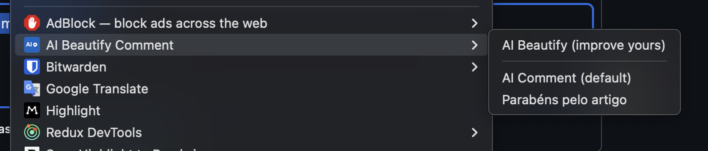

# AI Beautify Comment

A Chrome extension that enhances and generates professional comments on any website using Google's Gemini 1.5 Flash model with custom prompts, multiple response options, and automatic clipboard integration.

## 📸 Screenshots

### New Context Menu v3.0.0 - Enhanced Hierarchy

*Featuring AI Beautify (improve yours) at the top, visual separator, and AI Comment (default) for better organization*

### API Key Configuration


### Custom Prompts Management  


### Multiple Response Selection


## 🚀 Features

### Core Functionality
- 🤖 **AI-powered comment generation** using Gemini 1.5 Flash
- 📋 **Automatic clipboard integration** with one-click copy
- 🌍 **Multi-language support** (preserves post language)
- 🎨 **Professional interface for comment enhancement**

### New Advanced Features
- ✨ **Custom Prompts System** - Create up to 5 personalized prompts for different comment styles
- 🎯 **Multiple Response Generation** - Generate 1-5 responses per prompt with modal selection
- ⚡ **Smart Auto-Copy** - Single responses auto-copy, multiple responses show selection modal
- ⚙️ **Global Settings** - Configure default response count and manage all prompts
- 🛡️ **Enhanced Error Handling** - Detailed feedback with timeout protection and specific error messages
- 🎨 **Improved UI/UX** - Better form layouts, inline help text, and consistent styling

### Security & Performance
- 🔒 **Secure local API key storage**
- ♿ **Accessibility-friendly design**
- 🔄 **Automatic update notifications**
- 🚀 **Fast and responsive with retry logic**
- ⏱️ **Intelligent timeout handling**

## 🆕 What's New in v3.1.0 - Architecture & Quality Update!

### 🏗️ Architecture Improvements
- **📁 Clean code organization** - Migrated to modular `src/` directory structure
- **🔧 Enhanced API client** - Extracted dedicated `GeminiApiClient` class for better maintainability
- **📦 Improved build system** - Updated validation and build scripts for new structure
- **📋 Comprehensive documentation** - Added security audit framework and quality guidelines

### 🚀 Reliability Enhancements  
- **⚡ Smart retry logic** - Exponential backoff for handling temporary API overloads (503 errors)
- **🛡️ Better error handling** - Distinct strategies for quota vs service availability issues
- **🔔 Enhanced notifications** - Improved user feedback for API quota scenarios
- **✅ Code quality** - Fixed all ESLint warnings and improved standards

### 🔧 Development Experience
- **🔍 Updated validation** - Scripts now work seamlessly with new file structure
- **📊 Version synchronization** - All configuration files properly aligned
- **🐛 Bug fixes** - Resolved Chrome notification connection issues
- **🧹 Code cleanup** - Removed debug code and improved maintainability

*For complete version history and previous releases, see [CHANGELOG.md](CHANGELOG.md)*

## 📦 Distribution

This extension is distributed via **Developer Mode** (not through Chrome Web Store) for maximum control and to avoid potential Terms of Service conflicts.

### For Users: [Installation Guide](DISTRIBUTION.md)
👆 **Click here for complete installation instructions**

### For Developers: Building & Distribution

#### Quick Build
```bash
./build.sh
```

This creates:
- `dist/` folder for testing in Chrome
- `ai-beautify-comment-v*.zip` for distribution

#### Distribution Workflow
1. **Build the extension** using the build script
2. **Test locally** by loading the `dist` folder in Chrome
3. **Create GitHub Release** and upload the ZIP file
4. **Update version.json** to trigger update notifications

#### Update System
The extension includes an automatic update checker:
- Checks for updates daily via GitHub
- Shows badge notification when updates are available
- Users get notified through the popup interface

**Important:** Update the `GITHUB_VERSION_URL` in `background.js` and `version.json` with your actual repository URL.

## 🔧 Configuration

### API Key Setup
1. Get your [Google Gemini API key](https://aistudio.google.com/app/apikey)
2. Click the extension icon in Chrome
3. Enter your API key (starts with `AIzaSy`)
4. Click "Save API Key"

### Custom Prompts Setup
1. Switch to the **"Custom Prompts"** tab
2. Click **"Add New Prompt"** to create personalized prompts
3. Configure each prompt with:
   - **Name** - Appears in right-click context menu
   - **Instructions** - Tell the AI how to generate comments
   - **Response Count** - Generate 1-5 responses (1 = auto-copy, 2+ = modal selection)
   - **Enabled/Disabled** - Show/hide in context menu
4. Use **Global Settings** to set default response count for the built-in prompt

### How to Use
1. **Go to any website** (social media, blogs, forums, etc.)
2. **Select the text** you want to work with
3. **Right-click** and choose from available options:
   - **"AI Beautify (improve yours)"** - Enhance your own writing with in-place replacement
   - **"AI Comment (default)"** - Generate professional comments about content
   - Your custom prompts (if created)
4. **Results depend on feature and response count**:
   - **AI Beautify**: Text is improved and replaced in place (or copied to clipboard)
   - **AI Comment with 1 response**: Automatically copied to clipboard
   - **AI Comment with 2+ responses**: Modal opens for you to choose the best option

### Supported Languages
- English, Portuguese, Spanish, French
- German, Italian, Russian, Japanese
- Korean, Chinese, Arabic, Hindi

## 🛡️ Security & Privacy

- **Local Storage:** API keys stored securely using `chrome.storage.local`
- **No Data Collection:** Extension doesn't collect or transmit user data
- **Direct API Calls:** Only communicates with official Google Gemini API
- **Open Source:** Full source code available for inspection
- **Security Audit:** Comprehensive security documentation available in `SECURITY_FIXES.md`
- **Quality Assurance:** Automated linting and validation for code security

## ⚠️ Important Disclaimers

**Website Terms of Service:** This tool should be used in compliance with the terms of service of websites where you use it. Users assume all responsibility for compliance with applicable terms of service.

**AI-Generated Content:** Always review and edit AI-generated comments before posting. The tool is designed to assist, not replace, human judgment.

## 🔄 Development

### Prerequisites
- Node.js (version 16.x or higher)
- npm or yarn

### Getting Started
```bash
# Clone the repository
git clone https://github.com/norato/ai-beautify-comment.git
cd ai-beautify-comment

# Install dependencies
npm install

# Build extension from src/ to dist/
npm run build

# Run validation checks
npm run check

# Create distribution ZIP
npm run zip
```

### Development Scripts
- **`npm run build`** - Build extension from src/ to dist/ directory
- **`npm run lint`** - Run ESLint to check code quality and style
- **`npm run lint:fix`** - Automatically fix linting issues where possible
- **`npm run validate`** - Comprehensive extension validation (files, manifest, versions)
- **`npm run syntax-check`** - Basic JavaScript syntax verification
- **`npm run check`** - Run all validations (lint + validate) 
- **`npm run zip`** - Create distribution ZIP after validation
- **`npm run preversion`** - Pre-release validation (runs check automatically)
- **`npm test`** - Run syntax check and linting

### Quality Assurance
Before any commit or release:
1. **`npm run check`** - Ensures code quality and extension integrity
2. **Manual testing** - Load extension in Chrome and test both AI Beautify and AI Comment
3. **Multi-language testing** - Test with different languages to verify Gemini detection

### File Structure
```
ai-beautify-comment/
├── src/                   # Source code directory
│   ├── manifest.json      # Extension configuration
│   ├── background.js      # Service worker with update system
│   ├── content.js         # Content script for clipboard operations
│   ├── utils.js          # Utility functions and error handling
│   ├── assets/           # Extension assets
│   │   └── icon.png      # Extension icon
│   ├── popup/            # Extension popup interface
│   │   ├── popup.html    # Popup HTML structure
│   │   ├── popup.js      # Popup JavaScript logic
│   │   └── popup.css     # Popup styling
│   └── gemini/           # Gemini API integration
│       └── gemini-api.js # Dedicated API client class
├── scripts/              # Build and validation scripts
│   ├── build.js         # Build automation script
│   ├── create-zip.js    # ZIP creation for distribution
│   └── validate.js      # Extension validation script
├── dist/                 # Built extension (created by build script)
├── version.json          # Version info for updates
├── package.json          # NPM configuration and scripts
├── CHANGELOG.md          # Version history and changes
├── SECURITY_FIXES.md     # Security audit and improvement tracking
├── CLAUDE.md             # AI collaboration guide
├── README.md             # This file
└── DISTRIBUTION.md       # User installation guide
```

### Update Process
1. Update `src/manifest.json` version
2. Update `version.json` with new version and release notes
3. Update `package.json` version to match
4. Run `npm run build` to create distribution package
5. Run `npm run zip` to create ZIP file
6. Create GitHub Release with the ZIP file
7. Users will be automatically notified of the update

### Technologies Used
- Chrome Extensions Manifest V3
- Google Gemini 1.5 Flash API
- JavaScript ES6+
- CSS3 with animations
- Chrome Storage & Alarms APIs

## 📄 License

MIT License - feel free to modify and distribute

## 🤝 Contributing

1. Fork the repository
2. Create a feature branch
3. Make your changes
4. Test the extension locally
5. Create a pull request

## 📞 Support

- [Report Issues](https://github.com/norato/ai-beautify-comment/issues)
- [Feature Requests](https://github.com/norato/ai-beautify-comment/discussions)

---

**Made with ❤️ for better online communication everywhere**

*Remember: Use this tool responsibly and always review AI-generated content before posting.*