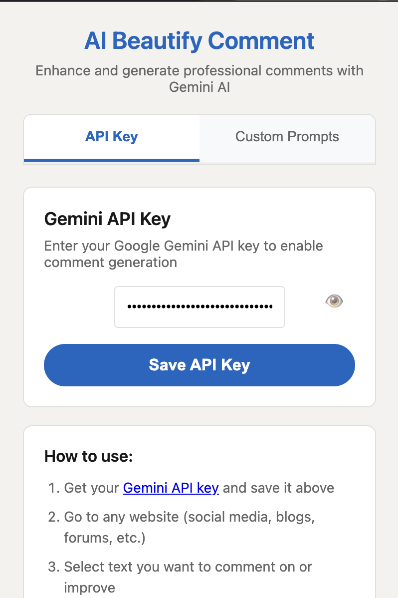

# AI Beautify Comment

A Chrome extension that enhances and generates professional comments on any website using Google's Gemini 1.5 Flash model with custom prompts, multiple response options, and automatic clipboard integration.

## 📸 Screenshots

### API Key Configuration


### Custom Prompts Management  


### Multiple Response Selection


## 🚀 Features

### Core Functionality
- 🤖 **AI-powered comment generation** using Gemini 1.5 Flash
- 📋 **Automatic clipboard integration** with one-click copy
- 🌍 **Multi-language support** (preserves post language)
- 🎨 **Professional interface for comment enhancement**

### New Advanced Features
- ✨ **Custom Prompts System** - Create up to 5 personalized prompts for different comment styles
- 🎯 **Multiple Response Generation** - Generate 1-5 responses per prompt with modal selection
- ⚡ **Smart Auto-Copy** - Single responses auto-copy, multiple responses show selection modal
- ⚙️ **Global Settings** - Configure default response count and manage all prompts
- 🛡️ **Enhanced Error Handling** - Detailed feedback with timeout protection and specific error messages
- 🎨 **Improved UI/UX** - Better form layouts, inline help text, and consistent styling

### Security & Performance
- 🔒 **Secure local API key storage**
- ♿ **Accessibility-friendly design**
- 🔄 **Automatic update notifications**
- 🚀 **Fast and responsive with retry logic**
- ⏱️ **Intelligent timeout handling**

## 🆕 What's New in v2.2.0

### Enhanced User Experience
- **🛡️ Robust Error Handling** - Added 10-second API timeout with specific error messages for network failures, timeouts, and invalid keys
- **📱 Improved Form Layout** - Reorganized form groups into clean column layouts with help text positioned below input fields
- **🎯 Fixed Button Positioning** - Resolved UI issues where buttons appeared outside containers by implementing proper flexbox layouts
- **💬 Better Visual Feedback** - Added loading states with spinner animations and detailed validation messages
- **✨ Consistent UI Alignment** - All interface elements now stay within proper container boundaries

### Technical Improvements
- Replaced `position: absolute` with flexbox for better responsive design
- Added `Promise.race` for timeout handling in API requests
- Enhanced CSS specificity to prevent style conflicts
- Improved accessibility with better focus management

## 📦 Distribution

This extension is distributed via **Developer Mode** (not through Chrome Web Store) for maximum control and to avoid potential Terms of Service conflicts.

### For Users: [Installation Guide](DISTRIBUTION.md)
👆 **Click here for complete installation instructions**

### For Developers: Building & Distribution

#### Quick Build
```bash
./build.sh
```

This creates:
- `dist/` folder for testing in Chrome
- `ai-beautify-comment-v*.zip` for distribution

#### Distribution Workflow
1. **Build the extension** using the build script
2. **Test locally** by loading the `dist` folder in Chrome
3. **Create GitHub Release** and upload the ZIP file
4. **Update version.json** to trigger update notifications

#### Update System
The extension includes an automatic update checker:
- Checks for updates daily via GitHub
- Shows badge notification when updates are available
- Users get notified through the popup interface

**Important:** Update the `GITHUB_VERSION_URL` in `background.js` and `version.json` with your actual repository URL.

## 🔧 Configuration

### API Key Setup
1. Get your [Google Gemini API key](https://aistudio.google.com/app/apikey)
2. Click the extension icon in Chrome
3. Enter your API key (starts with `AIzaSy`)
4. Click "Save API Key"

### Custom Prompts Setup
1. Switch to the **"Custom Prompts"** tab
2. Click **"Add New Prompt"** to create personalized prompts
3. Configure each prompt with:
   - **Name** - Appears in right-click context menu
   - **Instructions** - Tell the AI how to generate comments
   - **Response Count** - Generate 1-5 responses (1 = auto-copy, 2+ = modal selection)
   - **Enabled/Disabled** - Show/hide in context menu
4. Use **Global Settings** to set default response count for the built-in prompt

### How to Use
1. **Go to any website** (social media, blogs, forums, etc.)
2. **Select the text** you want to comment on or respond to
3. **Right-click** and choose from available prompts:
   - **"Generate Professional Comment"** (default prompt)
   - Your custom prompts (if created)
4. **Results depend on response count**:
   - **1 response**: Automatically copied to clipboard
   - **2+ responses**: Modal opens for you to choose the best option

### Supported Languages
- English, Portuguese, Spanish, French
- German, Italian, Russian, Japanese
- Korean, Chinese, Arabic, Hindi

## 🛡️ Security & Privacy

- **Local Storage:** API keys stored securely using `chrome.storage.local`
- **No Data Collection:** Extension doesn't collect or transmit user data
- **Direct API Calls:** Only communicates with official Google Gemini API
- **Open Source:** Full source code available for inspection

## ⚠️ Important Disclaimers

**Website Terms of Service:** This tool should be used in compliance with the terms of service of websites where you use it. Users assume all responsibility for compliance with applicable terms of service.

**AI-Generated Content:** Always review and edit AI-generated comments before posting. The tool is designed to assist, not replace, human judgment.

## 🔄 Development

### File Structure
```
ai-beautify-comment/
├── manifest.json          # Extension configuration
├── background.js          # Service worker with update system
├── content.js             # Content script for clipboard operations
├── popup.html/js/css      # Extension popup interface
├── utils.js              # Utility functions and error handling
├── icon.png              # Extension icon
├── version.json          # Version info for updates
├── build.sh              # Build script
├── README.md             # This file
└── DISTRIBUTION.md       # User installation guide
```

### Update Process
1. Update `manifest.json` version
2. Update `version.json` with new version and release notes
3. Run `./build.sh` to create distribution package
4. Create GitHub Release with the ZIP file
5. Users will be automatically notified of the update

### Technologies Used
- Chrome Extensions Manifest V3
- Google Gemini 1.5 Flash API
- JavaScript ES6+
- CSS3 with animations
- Chrome Storage & Alarms APIs

## 📄 License

MIT License - feel free to modify and distribute

## 🤝 Contributing

1. Fork the repository
2. Create a feature branch
3. Make your changes
4. Test the extension locally
5. Create a pull request

## 📞 Support

- [Report Issues](https://github.com/norato/ai-beautify-comment/issues)
- [Feature Requests](https://github.com/norato/ai-beautify-comment/discussions)

---

**Made with ❤️ for better online communication everywhere**

*Remember: Use this tool responsibly and always review AI-generated content before posting.*